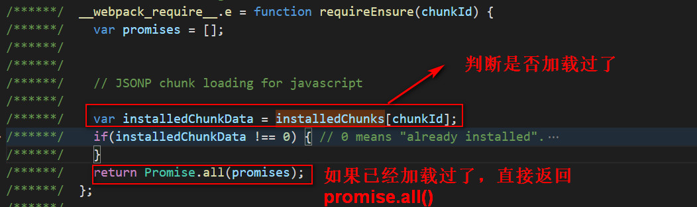
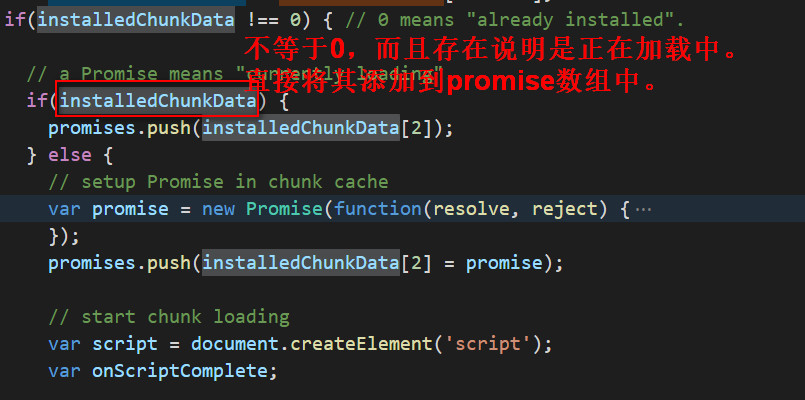
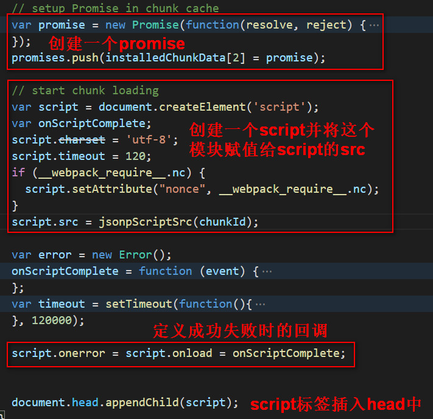

# import()异步加载的实现原理


## 按需加载
当页面中的一个文件过大，而且并不一定用到的时候，我们希望在使用到的时候才开始加载，这就是按需加载。
按需加载的实现方法是：动态创建script标签，并将src属性指向对应的文件路径。但是在实现过程中，存在下面问题：
1. 怎么保证相同的文件只加载一次。(可能第一想法就是使用cache缓存所有的已经加载的模块)
2. 怎么判断文件加载完成
3. 文件加载完成之后，怎么通知所有引入文件的地方

ES中提案`import()`语法就是为了解决这个问题。因此，我们接下来的就是去研究webpack到底是如何实现的？

## webpack的内部按需加载的实现
我们可以看下，我们打包后出现了两个bundle.js文件，其中一个是`0.bundle.js`，是整个项目各个模块的所有内容。
另外一个是`bundle.js`，里面是webpack定义的一些方法，比如`require`方法等，这里面也有我们异步加载的方法的实现`__webpack_require__`这个方法。如下所示：
```js
 	__webpack_require__.e = function requireEnsure(chunkId) {
 		var promises = [];
 		// JSONP chunk loading for javascript
 		var installedChunkData = installedChunks[chunkId];
 		if(installedChunkData !== 0) { // 0 means "already installed".
 			// a Promise means "currently loading".
 			if(installedChunkData) {
 				promises.push(installedChunkData[2]);
 			} else {
 				// setup Promise in chunk cache
 				var promise = new Promise(function(resolve, reject) {
 					installedChunkData = installedChunks[chunkId] = [resolve, reject];
 				});
 				promises.push(installedChunkData[2] = promise);
 				// start chunk loading
 				var script = document.createElement('script');
 				var onScriptComplete;
 				script.charset = 'utf-8';
 				script.timeout = 120;
 				if (__webpack_require__.nc) {
 					script.setAttribute("nonce", __webpack_require__.nc);
 				}
 				script.src = jsonpScriptSrc(chunkId);
 				// create error before stack unwound to get useful stacktrace later
 				var error = new Error();
 				onScriptComplete = function (event) {
 					// avoid mem leaks in IE.
 					script.onerror = script.onload = null;
 					clearTimeout(timeout);
 					var chunk = installedChunks[chunkId];
 					if(chunk !== 0) {
 						if(chunk) {
 							var errorType = event && (event.type === 'load' ? 'missing' : event.type);
 							var realSrc = event && event.target && event.target.src;
 							error.message = 'Loading chunk ' + chunkId + ' failed.\n(' + errorType + ': ' + realSrc + ')';
 							error.name = 'ChunkLoadError';
 							error.type = errorType;
 							error.request = realSrc;
 							chunk[1](error);
 						}
 						installedChunks[chunkId] = undefined;
 					}
 				};
 				var timeout = setTimeout(function(){
 					onScriptComplete({ type: 'timeout', target: script });
 				}, 120000);
 				script.onerror = script.onload = onScriptComplete;
 				document.head.appendChild(script);
 			}
 		}
 		return Promise.all(promises);
 	};
```
这个函数一共做了以下几件事：
1. 定义一个promise数组，用来存储promise。
```js
var promises = [];
```
2. 根据是否等于0判断是否已经加载过了，如果已经加载过了直接返回`Promise.all()`。


3. 如果正在加载中，则返回存储此文件的对应的promise。

如上图所示，如果`installedChunkData`不等于0，而且这个值存在，说明它正处于加载中，这样的话，直接将存储过这个模块的promsie添加到promise数组中。
4. 如果没有加载过，先定义一个promise，然后创建script标签，加载此js，并定义成功和失败的回调。


5. 如何判断模块已经加载完毕了？
`webpackJsonpCallback`每个模块加载完毕之后会调用`webpackJsonpCallback`回调函数，在这个函数中会进行resolve，resolve表示回调完成，就可以通过then进行调用了。然后将`installedChunkData`的值设置为0。0表示加载完成。
按需加载的实现过程.jpg)